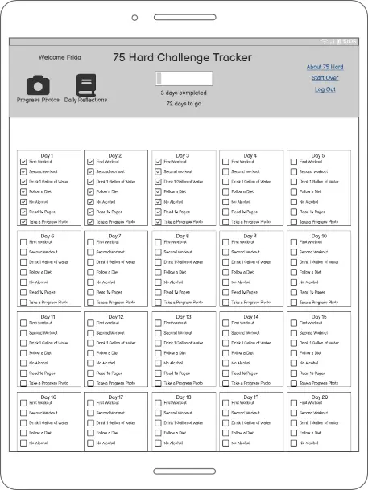
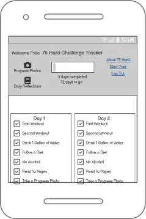
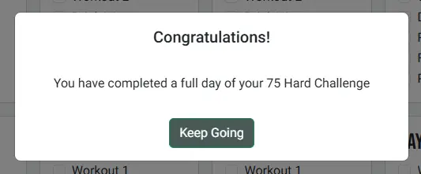
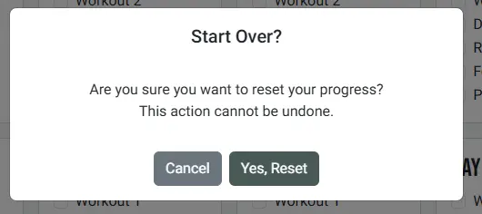
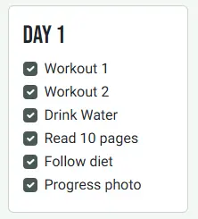
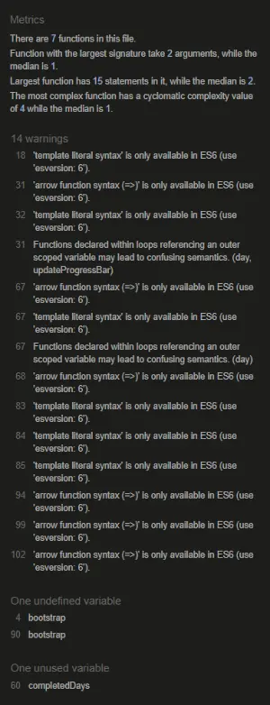

 ## Introduction

**75 Hard Tracker**

75 Hard Tracker is a simple and motivating web app designed to help users stay consistent with daily habits over a 75-day challenge. Inspired by the challenge created by Andy Frisella, the tool features a clean interface with a progress bar and a habit checklist.

It is available at https://fjii86.github.io/75-hard-tracker/

## UX

### Stategy and Scope: User Expectations and User Stories 

**Creator/Business Goals**

* Encourage Personal Growth - Help users stay consistent with healthy habits over a 75-day period, improving physical and mental well-being.

* Build a Motivational Tool - Create a visually engaging and easy-to-use tracker that motivates users through progress visualization and daily checklists.

* Expand Brand Presence - Use the tracker as a gateway product to build an audience around wellness, discipline, and self-improvement.

* Gather Feedback for Future Features - Learn from user behavior and feedback to evolve the tool into a full productivity/wellness app.

* Drive Traffic to Related Services - Integrate this tool into a broader personal brand or business offering.

**Potential Users**

**The Wellness Seeker**

**Frustrations**: Gets overwhelmed by complex apps or inconsistent planners.\
**Goals**: Wants to build healthy routines and break bad habits. Needs a simple interface that tracks her progress and keeps her motivated.

**The Growth-Oriented Beginner**

**Frustrations**: Easily loses motivation when she doesn't see her progress.\
**Goals**: Improve confidence and build new habits. Needs a clear visual of how far she's come and tasks to check off daily.

**The Discipline Devotee**

**Frustrations**: Tools that don’t save progress or lack structure.\
**Goals**: Complete the 75-day challenge with 100% adherence. Needs a reliable, no-frills tracker that just works and helps her stay on track.

**User Stories**

* As a user, I want to check off my daily habits so that I can feel accomplished and stay motivated.
* As a user, I want to see how many days I’ve completed so I can track my progress over time.
* As a user, I want a clean and calming interface so I can focus on my goals without distractions.
* As a returning user, I want to continue where I left off without having to start over.

### Structural & Skeleton/Wireframes 

The layout consists of two sections:

* The header with navigation link and progress bar.
* The main content area that contains the daily habit trackers.

\
\

### Surface: Design Choices 

The design is clean and minimal, offering a calm and focused user experience — a deliberate contrast to the often intense, high-energy aesthetic commonly found in fitness apps.

## Features

The page features are very straightforward. The header section includes the title and a progress bar centered in the middle, showing how many days have been completed and how many are left in the challenge.

On the left side, there's a welcome message for the user, along with icons that will link to future features such as the progress photo gallery and daily reflection entries.

On the right side, there’s a link to the creator of the challenge, which opens in a new tab for users to read more about it. There's also an option to start the challenge over and erase all progress, as well as a log-out link — intended for when the site supports saving user progress.

The main section contains the cards for the habit tracker, with one card representing each day of the 75-day challenge.

When a user completes all the tasks for a specific day and checks them off, a modal appears to celebrate their progress. It congratulates the user and confirms that the day is marked as complete. The modal disappears when the user clicks outside of it or on the close button.

When the user clicks the “Start Over” link, a confirmation modal appears. It asks the user to confirm if they’re sure they want to reset all progress. This is to prevent accidental resets. If the user confirms, all progress is cleared and the tracker resets to day one.

The progress tracker updates automatically when a full day is completed. As soon as all tasks for the day are checked off, the completed day count increases by one, the progress bar fills up accordingly, and the number of days left decreases. This gives the user instant visual feedback on their progress through the challenge.

### Future Features
**User Accounts & Data Persistence**\
The site should eventually allow users to log in and save their progress, including progress photos and reflection entries. This functionality was not implemented yet, as we haven’t covered those technologies in the course.

**Navigation & Usability**\
A search or filter function could be added to quickly navigate to a specific day, instead of having to scroll.

**Focus on the Current Day**\
Completed days could automatically move to the bottom of the tracker, keeping the current day visible at the top for better focus.

**Back to Top Button**
The site should include a button that allows the user to quickly scroll back to the top of the page when browsing through the days, especially on smaller screens where a lot of scrolling is required.

## Technologies used

### Languages used:
HTML\
CSS \
JavaScript 

### Libraries used:
[Bootstrap](https://getbootstrap.com/) \
[Google Font](https://fonts.google.com/) \
[Font Awesome](https://fontawesome.com/) 

### Tools used:
VS Code\
Balsamiq\
Github\
[Gimp](https://www.gimp.org) to resize images\
[Cloudconvert](https://cloudconvert.com/png-to-webp) to convert images to .webp\
[favicon.io](https://favicon.io/) to make a favicon

## Deployment
The site is deployed via GitHub Pages. The steps to deploy are:

1. Log in to GitHub and select 75-hard-tracker from the repo list
2. Select settings from the top navigation bar
3. Select Pages from the menu on the left
4. Under Build and Deployment, select Deploy from branch in the Source drop-down list
5. In the Branch drop-down lists, select Main and /(root)
6. Click Save

## Testing

I used https://validator.w3.org/nu/ to check the HTML with no issues.\

I used https://jigsaw.w3.org/css-validator/ to check the CSS with no issues.\

I used https://jshint.com/ to check the JavaScript with a couple of warnings. Most of them saying that the arrow function and templates are only available in ES6. \

Manual testing was conducted using Google Chrome without any issues. The browser’s Developer Tools were used to verify responsiveness across various screen sizes. All interactive elements, such as the daily checkboxes, modals, and navigation links, were tested to ensure proper functionality on both desktop and mobile views.

Additional testing was performed on an iPhone using Safari. The site displayed correctly, and all key features such as the progress tracker, modals, and responsive layout worked as expected on a mobile device.

### Bugs

The favicon was not displaying correctly, so it was removed.

## Credits

[The 75 Hard challenge](https://andyfrisella.com/pages/75hard-info) is created by Andy Frisella 
